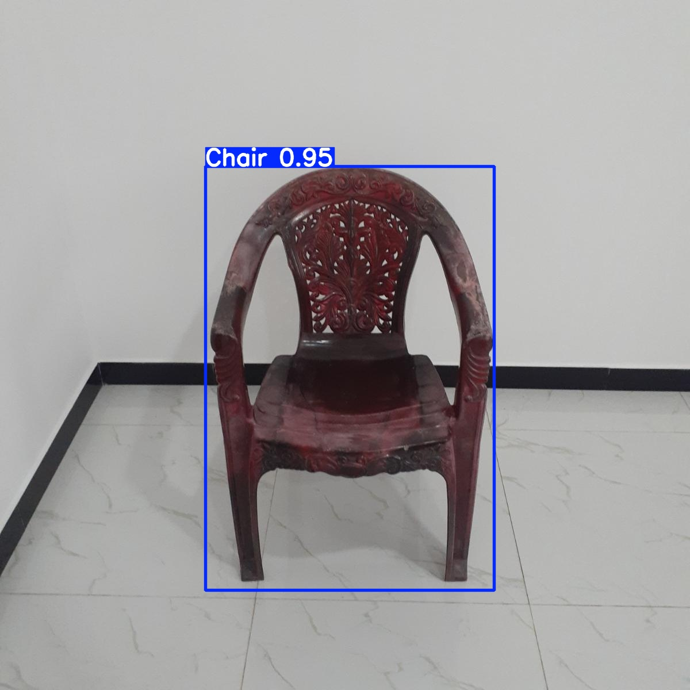
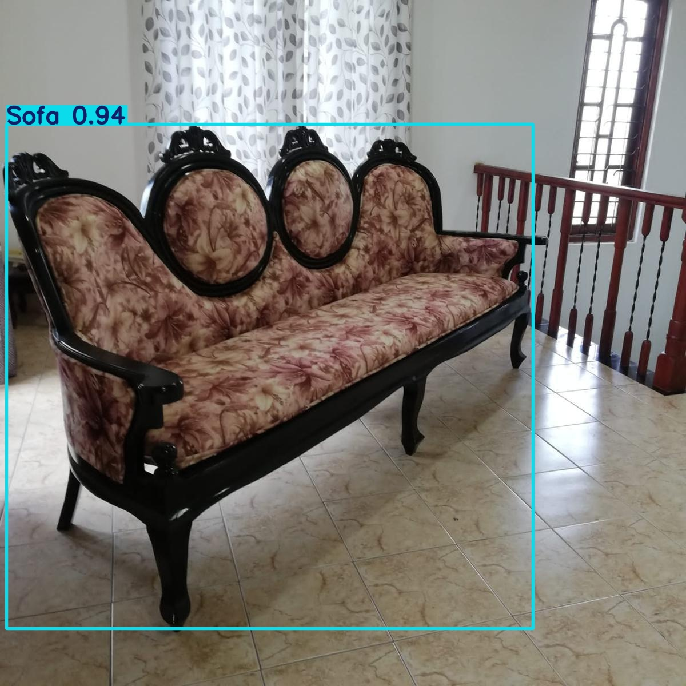
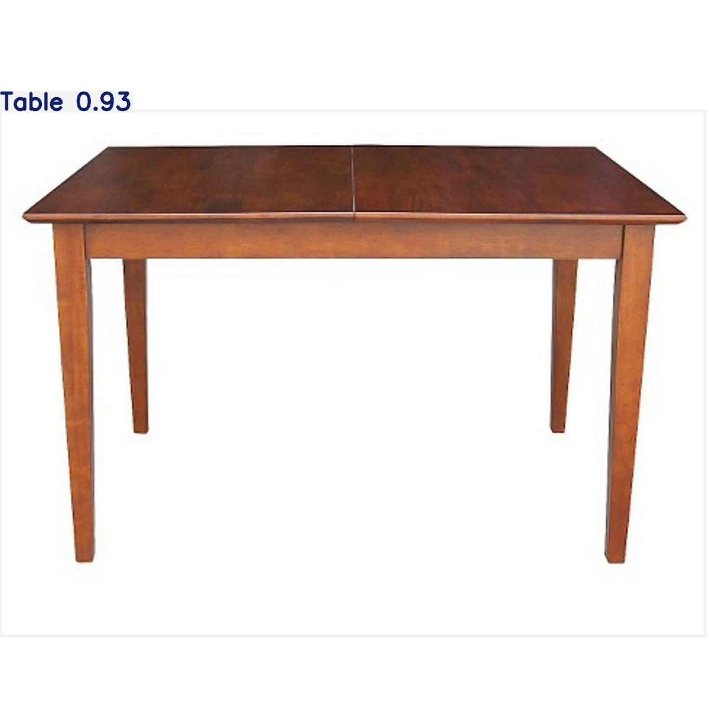
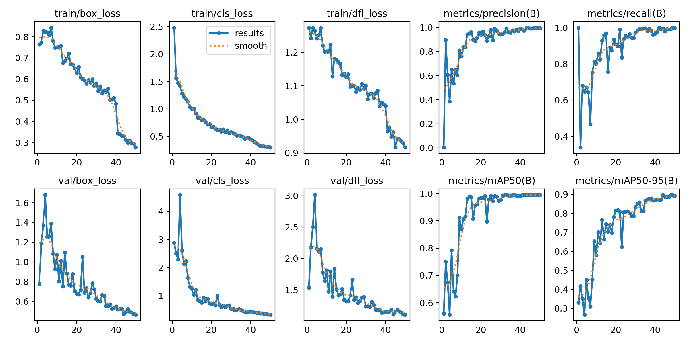

# Smart Retail Object Detection & Multi-Modal Analytics

This project demonstrates object detection in a smart retail setting using **YOLOv8**, with the goal of detecting key retail items such as chairs, tables, and sofas. The project also includes a foundation for multi-modal analytics.

---

## 👂 Project Structure

```
smart_retail/
├─ notebooks/
│   └─ Smart_Retail_Object_Detection.ipynb
├─ src/
│   ├─ detect.py
│   └─ multimodal.py
├─ data/
│   ├─ images/train
│   ├─ images/val
│   ├─ labels/train
│   └─ labels/val
├─ demo/
│   └─ sample_videos/
├─ results/               # Example predictions and plots
├─ README.md
└─ .gitignore
```

> Note: The full dataset is large. It can be accessed from Google Drive through a link below under 'Dataset'.

---

## ⚘️ Setup

1. Clone the repository:

```bash
git clone https://github.com/scouring/smart-retail-object-detection.git
cd smart-retail-object-detection
```

2. If using Google Colab, mount your Google Drive:

```python
from google.colab import drive
drive.mount('/content/drive')
```

---

## 🔨 Training YOLOv8

The project uses a **pretrained YOLOv8n model** (for CPU/GPU efficiency) and fine-tunes it on a custom dataset:

```python
from ultralytics import YOLO

model = YOLO("yolov8n.pt")

model.train(
    data='/content/drive/MyDrive/smart-retail-object-detection/data/my_dataset.yaml',
    epochs=50,
    imgsz=640,
    batch=16,
    project="/content/drive/MyDrive/smart-retail-object-detection/runs",
    name="train_yolov8"
)
```

---

## 🔍 Making Predictions

After training, predictions can be made on validation images:

```python
results = model.predict(
    source="/content/drive/MyDrive/smart-retail-object-detection/data/images/val",
    conf=0.25,
    save=True,
    project="/content/drive/MyDrive/smart-retail-object-detection/runs",
    name="predictions"
)
```

---

## 📈 Results

### Predictions





---

## 📊 Evaluation

### Model Performance




* ## Dataset

The dataset used for this project is stored in Google Drive.  
**Link:** [Download here](https://drive.google.com/drive/folders/1rzZ_pppwEoRIkaw8YeZU98_WMbWm0QLP?usp=sharing)

## 📌 Notes

* [YOLOv8 Documentation](https://docs.ultralytics.com/)
* [Ultralytics GitHub](https://github.com/ultralytics/ultralytics)
